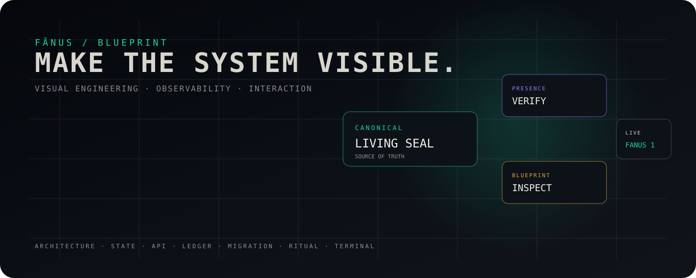

# FĀNUS BLUEPRINT

> **A visual engineering surface for the Fānus ecosystem.**

[](https://github.com/aminshahsaheb/fanus-blueprint)
[](https://fanus1.netlify.app)
[](https://fanus1.netlify.app)

<p align="center">
  
</p>

<p align="center"><sub>ARCHITECTURE · STATE · API · LEDGER · MIGRATION · RITUAL · TERMINAL</sub></p>

---

## ◇ QUICK SIGNAL

<p align="center">
  <a href="https://fanus1.netlify.app"><strong>OPEN FANUS 1 →</strong></a>
  &nbsp;&nbsp;·&nbsp;&nbsp;
  <a href="https://github.com/aminshahsaheb/fanus-blueprint">SOURCE →</a>
</p>

<details>
<summary><strong>READ THE SYSTEM IN 30 SECONDS</strong></summary>

```
CANONICAL CORE
     │
     ├── LIVING SEAL
     │
     ├── PRESENCE
     │
     └── BLUEPRINT
             │
             ├── ARCHITECTURE
             ├── STATE
             ├── API
             ├── LEDGER
             ├── MIGRATION
             ├── RITUAL
             └── TERMINAL
```

**Blueprint = visibility.**  
**Living Seal = canonical truth.**  
**Presence = verification surface.**

</details>

---

## ◈ THE BLUEPRINT

**Fānus Blueprint** is the visual and explanatory surface of the Fānus system.

It turns system architecture into an interface you can **see, inspect, and move through**:

`ARCHITECTURE` · `STATE` · `API` · `LEDGER` · `MIGRATION` · `RITUAL` · `TERMINAL`

This repository is not the canonical engine.

It is the **window into the system**.

---

## ◇ LIVE

**Fanus 1**

→ https://fanus1.netlify.app

**Repository**

→ https://github.com/aminshahsaheb/fanus-blueprint

---

## ◇ SYSTEM POSITION

```
                         FĀNUS
                           │
              ┌────────────┴────────────┐
              │                         │
       LIVING SEAL                  ECOSYSTEM
       canonical core                  │
              │            ┌────────────┼────────────┐
              │            │            │            │
              └──────→ PRESENCE       APP       BLUEPRINT
                           │                         │
                    runtime / verify          visual / inspect
                                                      │
                                                      ▼
                                             fanus1.netlify.app
```

### Boundary

| Surface | Role |
|---|---|
| **Fanus-Living-Seal** | Canonical core / source of truth |
| **fanus-presence** | Presence + verification runtime |
| **fanus-app** | Application experience |
| **fanus-blueprint** | Visual engineering / observability surface |

> **One core. Multiple surfaces. No duplicated truth.**

---

## ◈ DESIGN LANGUAGE

The Blueprint follows a deliberately dark, technical visual language:

```
VOID
  ↓
PAPER
  ↓
WITNESS
  ↓
DRIFT
  ↓
SEAL
  ↓
SYSTEM
```

The interface combines:

- cinematic darkness
- monospace engineering typography
- restrained glow
- information-dense panels
- state-driven interaction
- architectural diagrams
- terminal / console metaphors
- responsive composition

The goal is not decoration.

**The visual system should make the architecture legible.**

---

## ◇ WHAT YOU CAN EXPLORE

### 01 — Architecture
See how the Fānus surfaces relate to the canonical core.

### 02 — State
Follow state transitions and system status as an interactive model.

### 03 — API
Inspect API concepts and client-side demonstrations.

### 04 — Ledger
Explore integrity, sealing, hashes, and browser-side ledger behavior.

### 05 — Migration
Walk through the migration model as a visual sequence.

### 06 — Ritual
Experience the interaction layer rather than reading about it.

### 07 — Terminal
Observe runtime-oriented telemetry and system feedback.

---

## ◈ TECHNICAL SHAPE

This repository intentionally remains a **standalone static site**.

```
index.html
    │
    ├── HTML / structure
    ├── CSS / visual system
    └── JavaScript / interaction
              │
              ├── browser APIs
              ├── selected CDN dependencies
              └── configured external/demo integrations
```

### Deployment

```
push → main
        │
        ▼
     GitHub
        │
        ▼
     Netlify
        │
        ▼
fanus1.netlify.app
```

No framework migration is required for the current deployment model.

---

## ◇ TRUTH MODEL

Not every visual element represents a production backend operation.

### Browser-real

- Web Crypto ledger hashing / sealing behavior
- client-side integrity checks
- GitHub API reads where configured
- configured API requests from the browser

### Demonstration

- simulated telemetry
- generated visual metrics
- mock/demo API concepts
- interactive migration / ritual sequences

**Visual presence is not proof of backend execution.**

That distinction is part of the Blueprint's engineering discipline.

---

## ◈ ENGINEERING RULES

1. **Protect the canonical core.**
2. **Do not duplicate backend truth here.**
3. **Never disguise simulation as production telemetry.**
4. **Preserve the established visual identity deliberately.**
5. **Prefer small, reviewable changes.**
6. **Audit desktop, mobile, keyboard, and touch behavior.**
7. **Do not introduce infrastructure that the project does not need.**
8. **Keep deployment explicit and reproducible.**

---

## ◇ STATUS

| Area | State |
|---|:---:|
| Original Fanus 1 source | ✓ |
| Independent repository | ✓ |
| Netlify deployment | ✓ |
| Production headers | ✓ |
| Responsive foundation | ✓ |
| Accessibility foundation | ✓ |
| Visual system refinement | ✓ |
| Runtime / dependency audit | ◌ |
| Full responsive QA | ◌ |
| Production endpoint verification | ◌ |
| Final visual regression | ◌ |

---

## ◈ PHILOSOPHY

> **The Blueprint does not replace the system.  
> It makes the system visible.**

---

### Fānus

**Living Seal · Presence · Application · Blueprint**

© Fānus ecosystem
